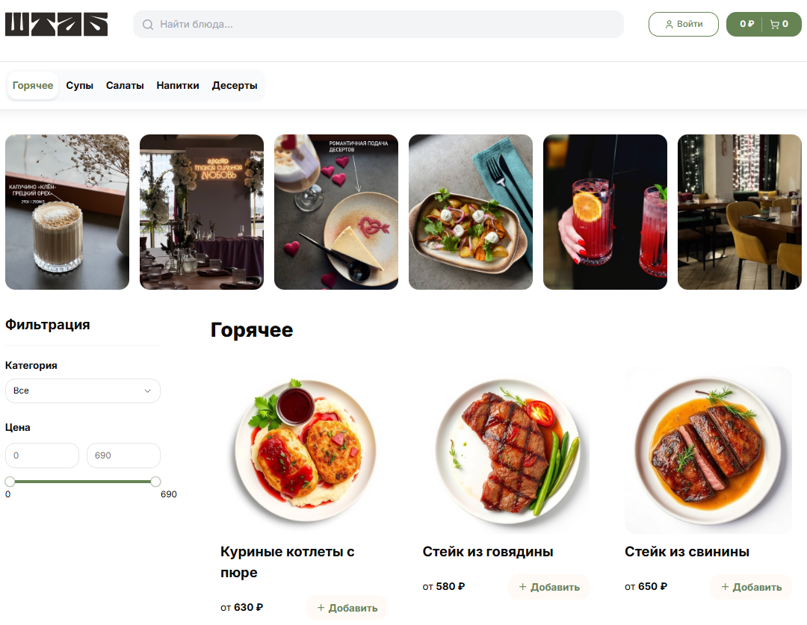
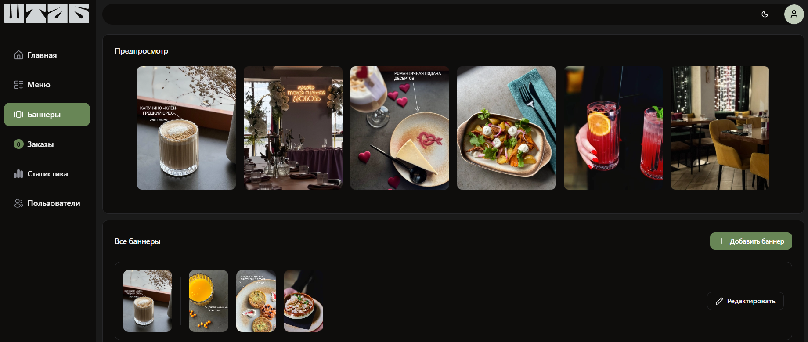
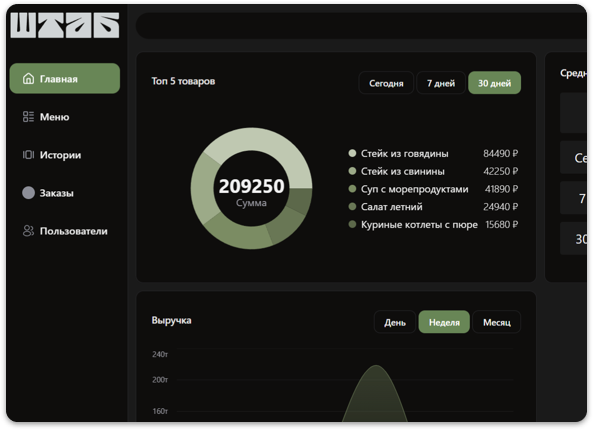

<br />
<div align="center">

  <h2 align="center"> 🍽️ Fullstack Restaurant Order System</h2>

  <p align="center">
    A full-featured restaurant management system with a client-facing web app and an admin panel.
Built with Next.js 15, .NET 8.0, PostgreSQL, Docker, and MinIO S3.
    <br />
  </p>
  <a>
    
  </a>
  <br />
  </p>
    <a>
    
  </a>
    <br />
  <a>
    
  </a>
</div>

---

## 🚀 Features

- .NET 8.0 REST API — order management service
- Admin Panel (Next.js 15) — manage menu, orders, and users
- Restaurant Frontend (Next.js 15) — customer-facing web app for placing orders
- PostgreSQL — main relational database
- MinIO S3 — object storage for dish photos and media files
- Docker Compose — easy deployment with a single command

## 📦 Stack

### 🖥️ Backend (.NET 8)
| Library | Description |
|----------|--------------|
| **EF Core** | Object–relational mapper (ORM) for PostgreSQL, simplifying data access and migrations. |
| **MediatR** | Implements the mediator pattern for clean, decoupled CQRS architecture and better command/query handling. |
| **Swagger** | Generates interactive API documentation with Swagger UI for testing endpoints. |
| **SignalR** | Enables real-time communication between server and clients (used for live order updates). |
| **ClosedXML** | Provides simple creation and export of Excel files (e.g., reports, analytics). |
| **JwtBearer Authentication** | Provides JWT-based authentication and authorization for secure API access. |
| **xUnit + Moq** | Unit testing framework and mocking library used for backend service testing. |

---

### 🌐 Frontend (Next.js 15)
| Library | Description |
|----------|--------------|
| **Next.js 15** | React-based full-stack framework for SSR, routing, and optimized performance. |
| **Prisma ORM** | Type-safe database ORM with PostgreSQL integration and schema management. |
| **NextAuth.js** | Authentication framework with Prisma adapter for secure session handling. |
| **Tailwind CSS** | Utility-first CSS framework for fast and responsive UI development. |
| **Radix UI + shadcn/ui** | Accessible and customizable React UI primitives used to build modern interfaces. |
| **Jest + ts-jest** | JavaScript/TypeScript testing framework used for frontend unit testing. |

---

## Setup 

1. Setup backend

```bash
cd backend/api
docker-compose up --build
```

2. Setup Minio S3

- Open minio console in 9001 port

- Set up the access keys

- Create bucket and add access policy

```json
{
  "Version": "2012-10-17",
  "Statement": [
    {
      "Effect": "Allow",
      "Principal": {
        "AWS": ["*"]
      },
      "Action": ["s3:GetObject", "s3:ListBucket"],
      "Resource": ["arn:aws:s3:::bucket-name", "arn:aws:s3:::bucket-name/*"]
    }
  ]
}
```


3. Setup frontend

```bash
cd frontend
docker-compose up --build
```

4. Service Access

| Service               | URL                                                            |
| --------------------- | -------------------------------------------------------------- |
| Restaurant App     | [http://localhost:3001](http://localhost:3001)                 |
|  Admin Panel     | [http://localhost:3000](http://localhost:3000)                 |
|  Order API (.NET 8) | [http://localhost:8080/swagger](http://localhost:8080/swagger) |
|  MinIO Console      | [http://localhost:9001](http://localhost:9001)                 |
| PostgreSQL        | localhost:5432                                                 |

